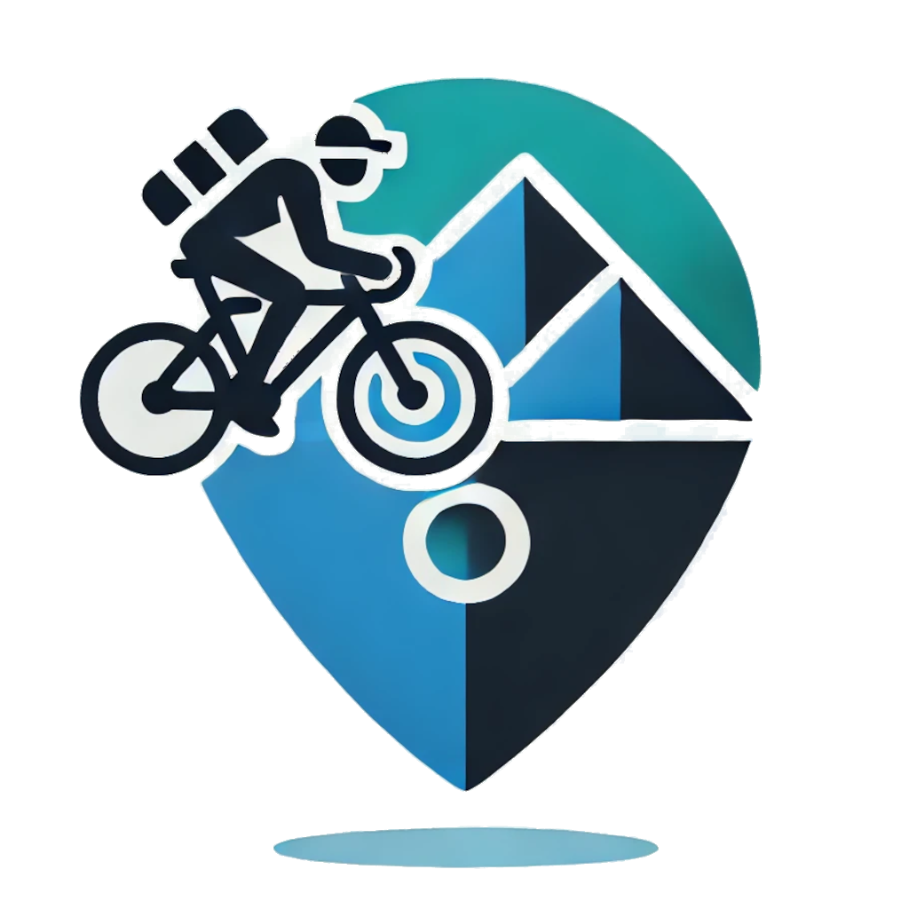
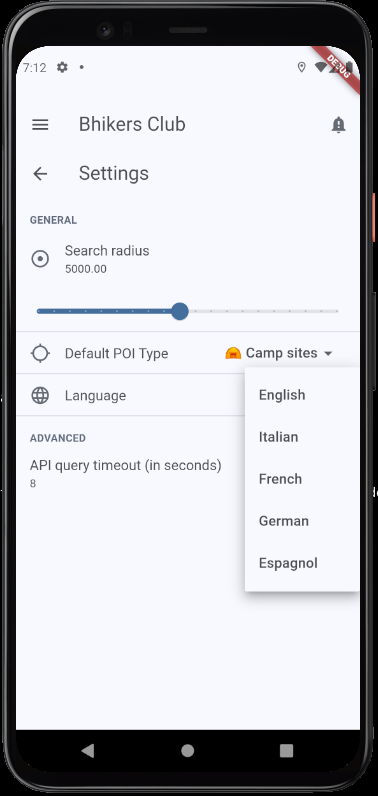
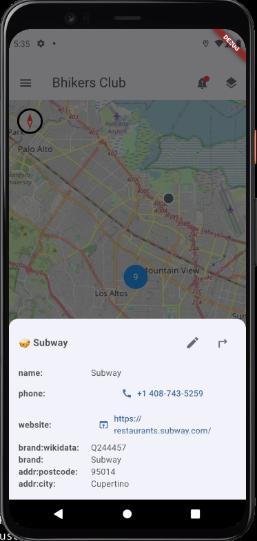

  

  

# 🇩🇪 bhikers club app – Dein unverzichtbarer Radbegleiter

  
  
  
  

## 📌 Über die App
**Bhikers club** ist eine kostenlose und datenschutzfreundliche mobile App für Radfahrer und Wanderer, basierend auf OpenStreetMap-Daten und -Diensten. Sie hilft dir, wichtige Orte auf deiner Route zu finden, sei es ein **Restaurant**, eine **Bäckerei**, ein **Hotel**, ein **Campingplatz**, ein **Unterschlupf** oder ein **Wasserbrunnen**.

🚴‍♀️ **Eines unserer Ziele ist es, mehr fahrradfreundliche Orte** zu kartieren!  
Benutzer können dazu beitragen, indem sie **OpenStreetMap (OSM)** Points of Interest (POIs) mit dem speziellen Tag [bike_friend](https://taginfo.openstreetmap.org/keys/bike_friend#overview) versehen, um die Fahrrad-Community zu stärken.  

## 🛠 Funktionen
- ✅ Finde **Restaurants, Bäckereien, Hotels, Campingplätze, Unterkünfte, Wasserbrunnen...** in deiner Nähe
- ✅ **Mit einer GPS-Navigations-App teilen**
- ❌ **Offline-Modus** – *Bald verfügbar!*
- ❌ **GPX-Dateien verbessern** – *Bald verfügbar!*
- ❌ **bike_friend-POIs taggen** – *Bald verfügbar!*

## 📜 Manifeste
- 🚴 [Bhikers Club Good Fellow Manifest](src/resources/manifestos/BHIKERS_CLUB_GOOD_FELLOW.de.md)
- 📱 [Das Frugal App Manifest](src/resources/manifestos/FRUGALAPP_MANIFESTO.de.md)

## 🙏 Besondere Dankbarkeit
Wir möchten den großartigen OpenStreetMap-, Clojure- und ClojureDart-Communities unseren Dank aussprechen. Vielen Dank für eure Unterstützung!

🌷🚴‍♀️ Meine ewige Dankbarkeit an Zéfal, Léon Giran-Max und Marie-Antoine Barret. 🚴‍♀️🌷

