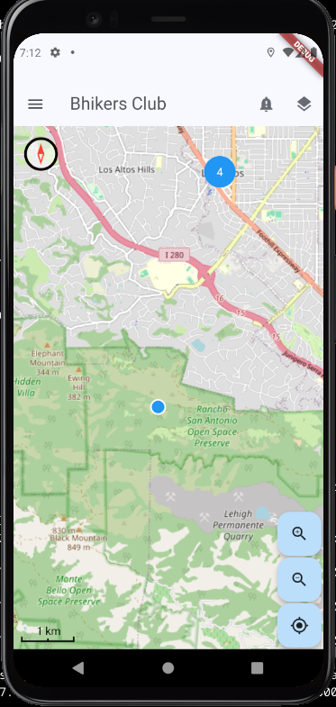

  

  

# 🇫🇷 bhikers club app – Votre compagnon vélo essentiel

  
  
  
  

## 📌 À propos
**Bhikers club** est une application mobile gratuite et respectueuse de la vie privée pour les cyclistes et randonneurs, basée sur les données et services OpenStreetMap. Elle vous aide à trouver des endroits essentiels en chemin, que vous ayez besoin d’un **restaurant**, d’une **boulangerie**, d’un **hôtel**, d’un **camping**, d’un **abri** ou d’une **fontaine d’eau**.

🚴‍♀️ ** L'un de nos objectifs est de cartographier plus de lieux accueillants pour les cyclistes** ! Les utilisateurs peuvent contribuer en ajoutant le tag spécial [bike_friend](https://taginfo.openstreetmap.org/keys/bike_friend#overview) aux Points d'Intérêt (POI) dans **OpenStreetMap (OSM)**, renforçant ainsi la communauté cycliste.  

## 🛠 Fonctionnalités
- ✅ Trouver des **restaurants, boulangeries, hôtels, campings, abris, fontaines d’eau...** à proximité
- ✅ **Partager avec une appli de navigation GPS**
- ❌ **Mode hors ligne** – *Bientôt disponible !*
- ❌ **Améliorer les fichiers GPX** – *Bientôt disponible !*
- ❌ **Taguer les POIs bike_friend** – *Bientôt disponible !*

## 📜 Manifestes
- 🚴 [Manifeste du Bon Compagnon Bhikers Club](src/resources/manifestos/BHIKERS_CLUB_GOOD_FELLOW.fr.md)
- 📱 [Le Manifeste des Applications Frugales](src/resources/manifestos/FRUGALAPP_MANIFESTO.fr.md)

## 🙏 Remerciements Spéciaux
Nous tenons à exprimer notre gratitude envers les incroyables communautés OpenStreetMap,  et ClojureDart. Merci pour votre soutien!

🌷🚴‍♀️ Ma reconnaissance éternelle à Zéfal, Léon Giran-Max et Marie-Antoine Barret. 🚴‍♀️🌷

