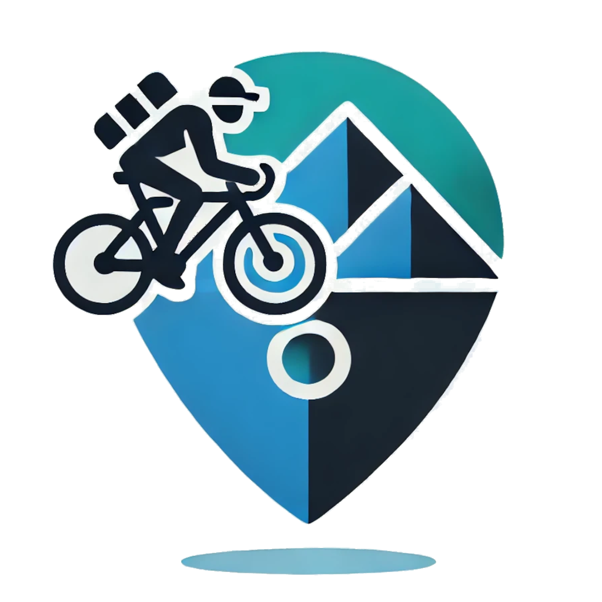
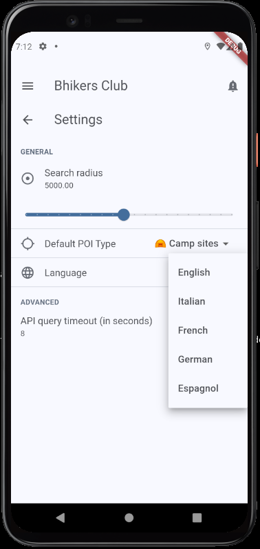
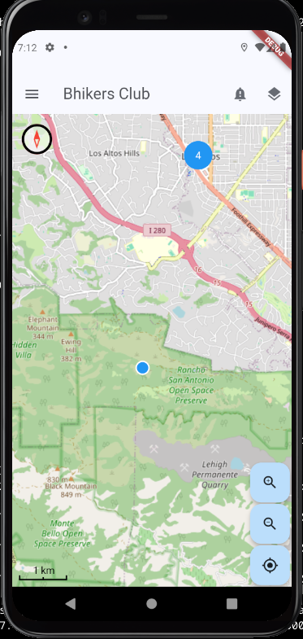
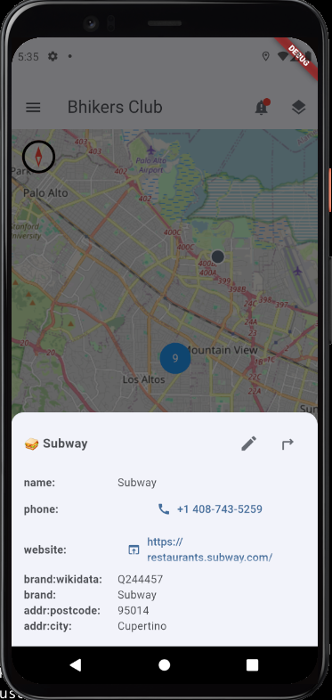

  

  

# bhikers club app – Your Essential Cycling Companion

🌍 **Read this in other languages:** 
🇬🇧 English | 🇫🇷 [Français](README.fr.md) | 🇩🇪 [Deutsch](README.de.md) | 🇪🇸 [Español](README.es.md) | 🇮🇹 [Italiano](README.it.md) 

  
  
  
  

## 📌 About
**Bhikers club** is a free and privacy-focused Android & iOS mobile app for cyclists and hikers, based on OpenStreetMap data and services. It helps you locate essential spots while on the road, whether you need a **restaurant**, a **bakery**, a **hotel**,  a **camping site**, a **shelter**, or a **water fountain**. 

🚴‍♀️ **One of our goal is to map more bhikers-friendly places!** Users can contribute by tagging Points of Interest (POIs) in **OpenStreetMap (OSM)** with the [bike_friend]https://taginfo.openstreetmap.org/keys/bike_friend#overview) special tag, making the cycling community stronger and more informed.

## 📦 Download

You can download the latest version of the **Bhikers Club** Android app directly from your browser:

➡️ [Download Latest APK](https://github.com/parasitid/bhikers.club/releases/latest/download/club.bhikers.bhikersclub_latest.apk)

This version is updated regularly with the latest features and fixes. Make sure to enable "Install from Unknown Sources" on your Android device before installing.

## 🛠 Features
- ✅ Find nearby **restaurants, bakeries, hotels, campgrounds, shelters, water fountains and stuff...**
- ✅ **Share with GPS navigation app**
- ❌ **Offline mode** – *Coming soon!* 
- ❌ **Enhance GPX** – *Coming soon!* 
- ❌ **Tag bike_friend POIs** – *Coming soon!* 

## 🛠 Work in Progress
The **Bhikers Club** app is currently in development and is not yet available in app stores. Stay tuned for updates and the official release!

## 🆘 Help Wanted!
We are currently seeking help to build and test the iOS version of the app. If you are an experienced iOS developer and would like to contribute, please reach out!

## 📜 Manifestos
- 🚴 [Bhikers Club Good Fellow Manifesto](src/resources/manifestos/BHIKERS_CLUB_GOOD_FELLOW.en.md)
- 📱 [The Frugal App Manifesto](src/resources/manifestos/FRUGALAPP_MANIFESTO.en.md)

## 🙏 Special Thanks

We would like to express our gratitude to the incredible OpenStreetMap, Clojure and ClojureDart communities. Thanks for your support!

🌷🚴‍♀️ My eternal gratitude to Zéfal, Léon Giran-Max and Marie-Antoine Barret. 🚴‍♀️🌷

